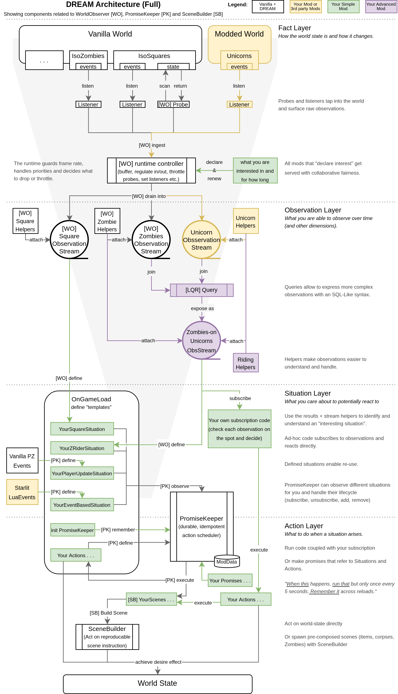

# DREAM - Declarative REactive Authoring Modules

A set of high-level lua modules for Project Zomboid [42SP] intended to help authors structure world-driven logic through composable, declarative building blocks.

---

#### Core Goals & Design Principles

1. **Optionality**  
   Each module is designed to stand on its own. They can be used independently or combined as needed.

2. **Opinionated Separation of Concerns**  
   Following the philosophy of reactive, world state–driven logic — sensing situations, deciding when actions are allowed to occur, and achieving desired effects on the world.  
   Concepts like observations, promises, and scenes are expressed in APIs and lifecycles, encouraging a shared vocabulary without prescribing a single way of working.

3. **Composability & Reusability**  
   Offering building blocks that capture recurring patterns at a higher level than raw events or tick logic.  
   By composing these blocks, authoring logic can become more compact and readable, with the goal of supporting faster iteration and more maintainable features over time.

4. **Control & Extensibility**  
   Working out of the box, while exposing settings and public interfaces for adjustment, extension through registration, and patching where needed.

---

## Included Mods

**Main**

- [`DREAM`](https://github.com/christophstrasen/pz-dream) [](https://github.com/christophstrasen/pz-dream/actions/workflows/ci.yml)
  - Convenient "bundle" that requires all other modules. (Repo name `pz-dream`)
  - Comes with extra examples and high level intro.
- [`WorldObserver`](https://github.com/christophstrasen/WorldObserver) [](https://github.com/christophstrasen/WorldObserver/actions/workflows/ci.yml)
  - A cooperative world-sensing engine.
- [`PromiseKeeper`](https://github.com/christophstrasen/PromiseKeeper) [](https://github.com/christophstrasen/PromiseKeeper/actions/workflows/ci.yml)
  - A stateful situation-to-action orchestrator.
- [`SceneBuilder`](https://github.com/christophstrasen/SceneBuilder) [](https://github.com/christophstrasen/SceneBuilder/actions/workflows/ci.yml)
  - A declarative scene composition framework.

**Supporting Dependencies**

- [`DREAMBase`](https://github.com/christophstrasen/DREAMBase) [](https://github.com/christophstrasen/DREAMBase/actions/workflows/ci.yml)
  - A small “base library” mod for the DREAM ecosystem (Build 42). 
  - dependency for All modules above
- [`LQR`](https://github.com/christophstrasen/LQR) [](https://github.com/christophstrasen/LQR/actions/workflows/ci.yml)
  - For expressing SQL‑like joins and queries over ReactiveX observable streams. 
  - [`pz-lqr`](https://github.com/christophstrasen/pz-lqr) "wraps" it into mod-shape
  - dependency for `WorldObserver`
- [`reactivex`](https://github.com/christophstrasen/lua-reactivex)
  - Gives Lua the power of Observables: data structures that represent a stream of values over time.
  - Handy for events, streams of data, asynchronous requests, and concurrency-like composition.
  - [`pz-reactivex`](https://github.com/christophstrasen/pz-reactivex) "wraps" it into mod-shape
  - dependency for `WorldObserver`

--- 

## Is this for you?

This suite is intended for experienced Project Zomboid modders.

It may be worth exploring if you are working on larger or longer-lived mods and find yourself wanting more structure as features interact and accumulate.

It is **not** intended as an introduction to modding. If you are new to Project Zomboid modding or still learning Lua fundamentals, this is likely not the right starting point.

The modules are under active development, currently focused on single-player, and may change as ideas are refined. While individual parts are usable on their own, the overall approach has not yet been validated in large, production-scale mods.

## Overview

 

---

## How the Pieces Fit Together

At a high level, DREAM supports a common flow found in world-driven gameplay systems:

> **Something becomes true in the world → a decision is made → something happens**

DREAM does not require this structure, but it is designed to *support and encourage* it by providing dedicated modules for each stage.

### 1. WorldObserver — Sensing the world

**WorldObserver** focuses on *observing* the game world and turning raw state into meaningful signals.

Instead of manually scanning tiles, entities, or events in isolation, mods declare *interest* in certain conditions (for example: nearby corpses, entered buildings, changing environments) and receive **observation streams** as those conditions evolve.
WorldObserver is designed to support **collaborative sensing across multiple mods**, consolidating shared observation work and helping avoid redundant scans that can negatively impact performance.

These streams represent *situations becoming true or changing over time*, and can be consumed directly or combined into higher-level signals.

### 2. PromiseKeeper — Gating, scheduling, and remembering

**PromiseKeeper** sits at the decision boundary.

Given a situation (from WorldObserver, a vanilla event, or custom logic), it answers questions like:

* *Should this run at all?*
* *Should it only run once?*
* *How often is it allowed to run?*
* *Should it persist across reloads?*

Promises encode these decisions explicitly and persist their outcomes, helping avoid duplicate triggers, accidental re-execution, or scattered state flags.

### 3. SceneBuilder — Acting on the world

**SceneBuilder** is responsible for *materializing outcomes* in the game world.

It provides a declarative way to author scenes — collections of world changes such as corpses, containers, items, zombies, or environmental details — with built-in support for fallback behavior, placement logic, and determinism where desired.

Scenes are typically triggered once a promise is fulfilled, but SceneBuilder can also be used independently wherever structured world authoring is needed.

### Putting it together

In practice, many features follow this pattern:

1. **Observe** a situation in the world (WorldObserver)
2. **Decide** if and when something should happen (PromiseKeeper)
3. **Materialize** a result in the world (SceneBuilder)

The diagrams above illustrate this flow both in simplified form and in full detail. Importantly, DREAM does not force mods into this pipeline — each module can be used on its own — but when combined, they form a coherent authoring model for complex, world-driven features.

---

## DREAM (this Repo)

This is the maintainer convenience repo for co-developing the DREAM mod family in one place.

This repo is **not** a mod. It contains the mod repos as git submodules and provides:

- VS Code workspace settings (mirrors your current setup style)
- one-command sync to `~/Zomboid/Workshop` (default)
- one-terminal watcher that re-syncs all mods on change

## Documentation scope

- **User-facing suite overview + curated examples:** `external/pz-dream/` (DREAM meta-mod), and its Workshop item.
- **Module-specific docs and APIs:** in each module repo under `external/<RepoName>/`.
- **Maintainer coordination:** this repo (scripts, submodule policy, dev standards, and the workspace logbook).

Maintainer logbook: `logbook.md`.

## Clone

```bash
git clone git@github.com:christophstrasen/DREAM.git
cd DREAM
git submodule update --init
```

Note: avoid `--recursive` unless you explicitly want nested submodules inside the mod repos.

## Local deploy

See `development.md` (workflow) and `DREAM_dev_standards.md` (standards/conventions).
